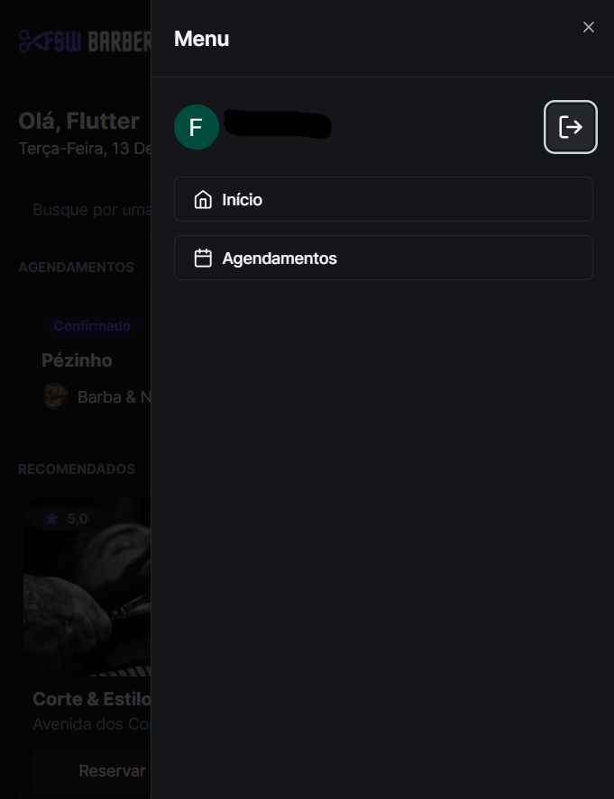
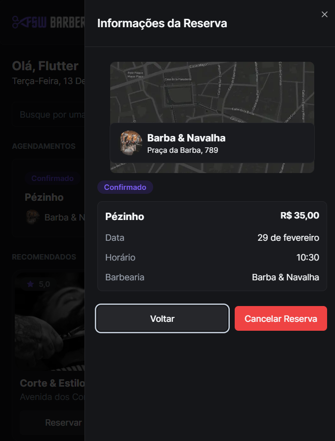
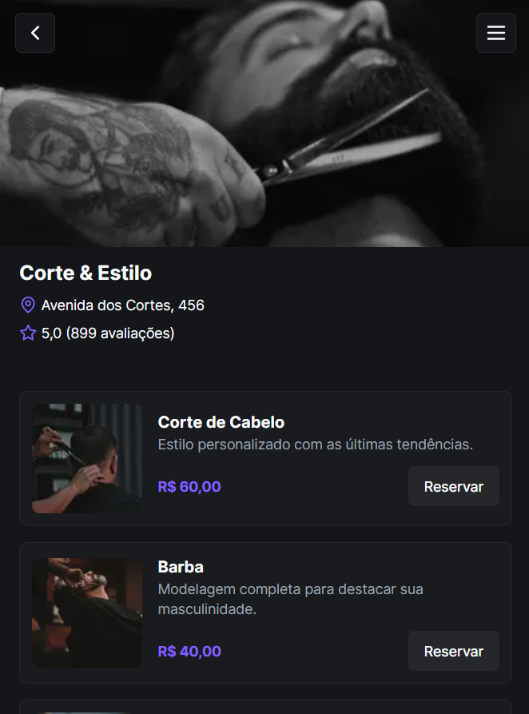
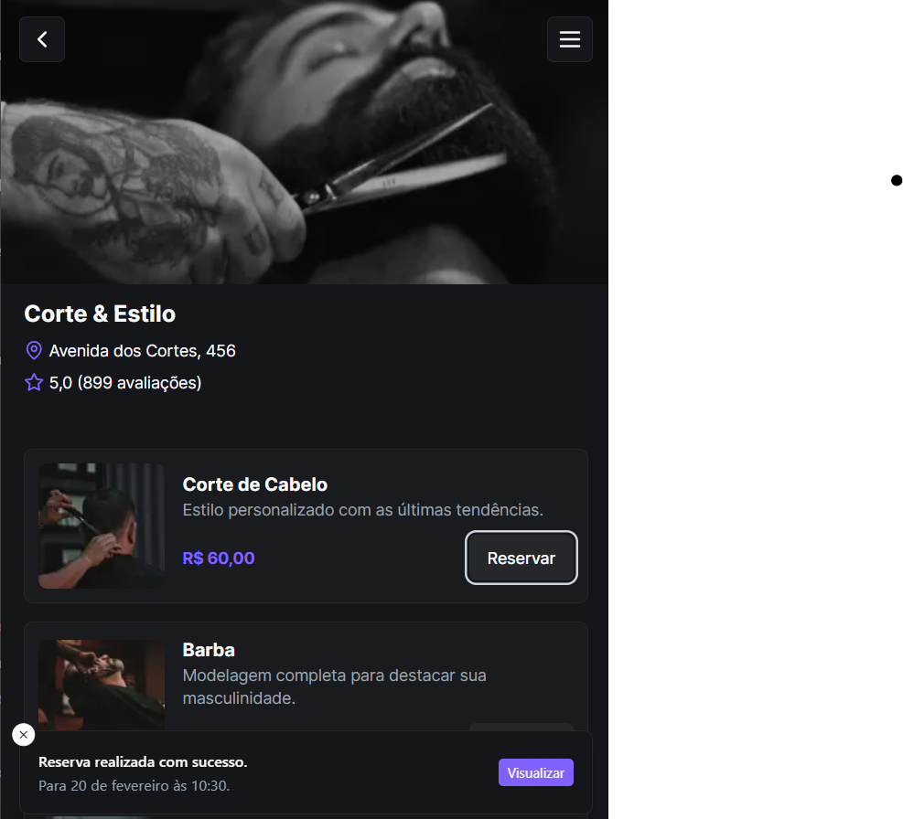

<p align="left">

  
  

  

</p>

### Tópicos

:small_blue_diamond: [Sobre o Projeto](#star-sobre-o-projeto)

:small_blue_diamond: [Objetivo](#dart-objetivo)

:small_blue_diamond: [Imagens](#sunrise_over_mountains-imagens)

:small_blue_diamond: [Funcionalidades](#bookmark_tabs-funcionalidades)

:small_blue_diamond: [Como rodar a aplicação](#arrow_forward-como-rodar-a-aplicação)

:small_blue_diamond: [Backlog](#dart-backlog)

## :star: Sobre o Projeto

Aplicação desenvolvida durante o evento Full Stack Week, evento gratuito organizado pelo Full Stack Club (https://fullstackclub.com.br/).

Este projeto foi desenvolvido utilizando:

:heavy_check_mark: NextJS

:heavy_check_mark: ReactJS

:heavy_check_mark: Prisma ORM

:heavy_check_mark: Autenticação com o Google

## :dart: Objetivo

Desenvolvimento de uma aplicação para controle de agendamentos de uma barbearia.

## :bookmark_tabs: Funcionalidades:

:white_check_mark: Agendamento
:white_check_mark: Cancelamento do Agendamento

## :sunrise_over_mountains: Imagens

<details>
<summary> Imagens da Aplicação </summary>








</details>

## :arrow_forward: Como rodar a aplicação

#### :warning: Pré-Requisitos

- A aplicação foi desenvolvida utilizando [Google OAuth Authentication](https://support.google.com/cloud/answer/6158849?hl=en), sendo assim será necessário configurar o OAuth 2.0 para autenticação.
- Necessário possuir um banco de dados configurado para a aplicação

#### :heavy_check_mark: Clonando o Projeto

- No terminal, clone o projeto:

  ```
  https://github.com/dgo-angelo/fullstackweek-barber.git
  ```

#### :wrench: Variáveis de Ambiente

- Na raiz do projeto será necessário criar o arquivo .env e preenche-lo com as informações abaixo:

```
DATABASE_URL="postgresql:usuario:senha@ip:porta/banco"
GOOGLE_CLIENT_ID=""
GOOGLE_CLIENT_SECRET=""
```

#### :wrench: Criação das Tabelas do Banco

Para criação das tabelas será necessário executar o comando abaixo, que será responsavel pela criação das tabelas com base nas migrations.

```
npx prisma migrate dev
```

#### :wrench: Populando o Banco de Dados

No projeto ja consta um pré-cadastro contendo informações como barbearias, serviços, etc

Para popular o banco de dados com estas informações é necessário executar o comando abaixo:

```
npx prisma db seed
```

### :arrow_forward: Executando a aplicação

- Acessar a pasta raiz do projeto e instalar as dependencias através do comando:

```
npm install
```

- Após instalar as dependencias, executar o comando abaixo para iniciar o projeto:

```
npx expo start --clear
```

## :dart: Backlog

:black_square_button: Tratamento da expiração do token

<hr/>
